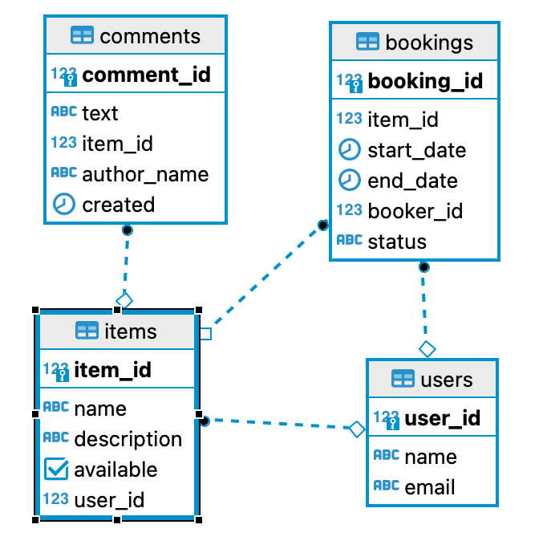

# Приложение "Shareit"
<picture>
    
</picture>
Сейчас экономика совместного использования, известная как шеринг, становится все более популярной. 
Если в 2014 году общемировой рынок шеринга составлял всего $15 млрд, то к 2025 году он может вырасти до $335 млрд. 
Но почему шеринг настолько популярен? Допустим, вы купили несколько картин на ярмарке и хотите повесить их дома, 
но для этого вам нужна дрель, которой у вас нет. Вы можете пойти в магазин и купить оборудование, 
но это не имеет особого смысла, так как после того, как вы повесите картины, дрель просто останется без дела в шкафу. 
Вы можете вызвать мастера и его услуги будут стоить денег:moneybag:, или вы можете получить удовольствие от того, 
что у вас есть друг, который поделился бы своей дрелью с вами. Если бы существовал специальный сервис, 
который объединяет людей, которые готовы делиться своими вещами, это было бы очень удобно. И такой сервис создан:coffee:.

## Функционал приложения:wrench:

По категориям:

1) **пользователь**:bust_in_silhouette::

    - добавление нового пользователя (эндпоинт `POST /users`)
    - получение списка всех пользователей (эндпоинт `GET /users`)
    - получение пользователя по идентификатору (идентификатор `{userId}` на эндпоинт `GET /users`)
    - обновление пользователя (идентификатор `{userId}`на эндпоинт `PATCH /users/{userId}`)
    - удаление пользователя по идентификатору (идентификатор `{userId}` на эндпоинт `DELETE /users`)

2) **вещь**:gift::

    - добавление вещи (идентификатор владельца `X-Sharer-User-Id` на эндпоинт `POST /items` с телом json)
    - обновление информации о вещи (`X-Sharer-User-Id` на эндпоинт `PATCH /items/{itemId}` с телом json)
    - получение информации о вещи (идентификатор `X-Sharer-User-Id` на эндпоинт `GET /items/{itemId}`)
    - получение списка всех вещей пользователя (`X-Sharer-User-Id` на эндпоинт `GET /items?from=&size=`,
      где `from` - показать с какой страницы и `size` сколько вещей показывать на одной странице)
    - поиск вещи по названию или описанию в парпметре `text` (на эндпоинт `GET /items/search?text=&from=&size=`)
    - добавление комментария к вещи (`X-Sharer-User-Id` на эндпоинт `POST /items/{itemId}/comment` с телом json)

3) **бронирование вещи (если вещь есть в базе данных)**:telephone_receiver::

    - добавление нового бронирования (`X-Sharer-User-Id` на эндпоинт `POST /bookings` с телом json )
    - подтверждение бронирования владельцем вещи (`X-Sharer-User-Id` на эндпоинт `PATCH /bookings/{bookingId}`)
    - получение бронирования по идентификатору (`X-Sharer-User-Id` на эндпоинт `GET /bookings/{bookingId}`)
    - получение всех бронирований пользователя (`X-Sharer-User-Id` на эндпоинт `GET /bookings?state=&from=&size=` 
      где `state=` статус бронирования (_ALL_ - все, _CURRENT_ - текущие, _PAST_ - прошедшие, _FUTURE_ - будущие),
      Если `state, from и size` не указывать, будут отображены первые 10 бронирований из всего списка _ALL_)
    - получение всех бронирований владельца вещей (на эндпоинт `GET /bookings/owner?state=&from=&size=` 
      в заголовке запроса передаётся идентификатор владельца вещей `X-Sharer-User-Id`) 

4) **запрос на аренду вещи (если вещи нет в базе данных)**:bookmark::

    - добавление нового запроса на аренду (`X-Sharer-User-Id` на эндпоинт `POST /requests` с телом json)
    - получение всех запросов пользователя (`X-Sharer-User-Id` на эндпоинт `GET /requests`)
    - получение всех имеющихся запросов на аренду (на эндпоинт `GET /requests/all?from=&size=`
      в заголовке запроса `X-Sharer-User-Id` передаётся идентификатор пользователя)
    - получение запроса на аренду по идентификатору (на эндпоинт `GET /requests/{requestId}` в
      идентификатор пользователя `X-Sharer-User-Id`, в переменную пути `{requestId}` - идентификатор запроса)

## Структура БД проекта :mag::
<picture>
    
</picture>

## Запуск приложения:cyclone::
Для запуска проекта у вас должна быть установлена Java версии 11 или выше.
Скачайте проект, откройте его в вашей любимой интегрированной среде разработки (IDE)
и запустите ShareItApp либо, выполнив команду в корневой директории проекта:
mvn spring-boot:run
Для остановки приложения в открывшейся консоли нажмите ctrl=c / cmd=c

## Стек применяемых технологий:pushpin::
*Java 11, Spring Boot, Maven, REST API, JDBC, H2, PostgreSQL, SQL, Hibernate - ORM, JUnit, MockMvc*

автор - [MityaDD](https://github.com/MityaDD)